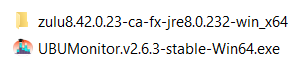
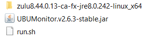
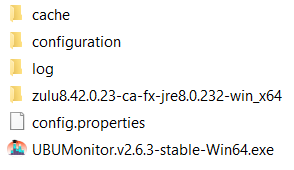

Appendix. File structure
========================

Below is the typical file structure of UBUMonitor.

Initial Content
---------------

If the portable version is installed, unzipping creates a directory:

* ``UBUMonitor.v2.6.3-stable-Win64-Portable`` on Windows 64 bits.
* ``UBUMonitor.v2.6.3-stable-Win32-Portable`` on 32-bit Windows.
* ``UBUMonitor.v2.6.3-stable-Linux64-Portable`` on GNU/Linux 64-bit.

In the directory created, we will have the following content in Windows (32-bit content is equivalent):

  
  Content in a portable Windows installation (for 64-bit)
  
While in GNU/Linux we will have the following content:

  
  Content in a portable installation on GNU/Linux (for 64 bits)
  
If the Java executable version is installed with ``.jar`` we will have the following content:

  
  Content in the installation with Java .jar executable
  
File and directory structure
----------------------------

After starting the application, downloading some courses and changing the default configuration, we will find the following directories and additional files (e.g. in Windows).

  
  File structure  
  
The ``config.properties`` file stores user-customized startup options (e.g. *Remember user*, *Remember host*, etc.)
  
On the other hand, the following directories are created:

* *cache*: contains the local cache of the files with the data of the downloaded courses. 
* *configuration*: stores the application configuration for the host, user and particular subject.
* *log*: directory where are generated the log files of the application. These files contain the execution and error logs that occur internally in the application. They are useful to forward them to the developers to correct possible errors or *bugs* that occur in the application.

The ``cache`` directory is organized on a first level by *host* and on a second level by user. In this directory one file is stored for each downloaded subject (e.g. *Psychology in Cinema (Art and Media)-62*). The ``configuration`` directory is organized in the same way.
  
This directory structure allows access to different Moodle servers from UBUMonitor, avoiding collisions in the case of matching user or course names.

**VERY IMPORTANT**: Portable versions include a directory with its own JRE distribution (e.g. ``zulu8.42.0.23-ca-fx-jre8.0.232-win_x64``, ``zulu8.44.0.13-ca-fx-jre8.0.242-linux_x64``, etc.) This directory **must not be changed**.