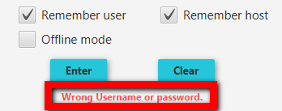
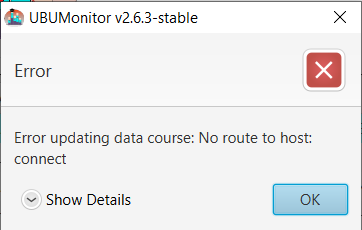
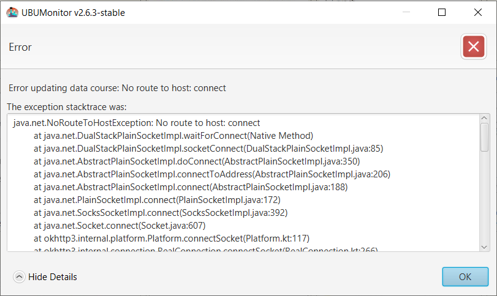

.. _errormessages:

Error Messages
==============

The application will display the various error messages, with two basic display formats: window embedded message or modal error dialog.

Message on window
-----------------

They are displayed in red at the bottom of the active window. They are caused by incorrect data entry. The figure shows the error when logging in with an incorrect user and/or password. 

  
  User validation error
 
Another example, in the following figure, shows the corresponding message if there is no network connection, informing that the connection to the indicated host is not possible.
  
.. figure:: images/error_sin_red.png
  :width: 200
  :alt: Network error connection
  :align: center
  
  Login network error connection
  
Error dialog
------------

A modal dialogue is opened with a text describing the error and the option to display **Show details**. In the following figure we see an example of an error when losing the network connection when loading a course.

  
  Network connection error loading course/subject
  
If we select the option **Show details**, a text box opens at the bottom of the dialog, with the trace of the error. 

  
  Details of the error in connection with the loading of the course
  
The information shown in the text box is technical, and although it is not of interest to the user, it is **Very IMPORTANT** to forward that text to the developers for the correction of errors or bugs in the application (you can select and copy the text directly).

Usual errors
------------

**Without teacher's role**

A common mistake is not having teacher (or non-editor) permissions for a course or community in which you are enrolled. In such cases a message like the following will be displayed:

.. figure:: images/error_sin_permisos_lectura.png
  :width: 300
  :alt: Error when loading a subject without a teacher's role
  :align: center
  
  Error when loading a subject without a teacher's role

**Incompatible cache version**

If we try to load a cache assignment, whose data file was generated with a different version of UBUMonitor, an error may occur as it is incompatible with the current version. In such cases, the cache must be cleared (**Clear** button) and the data downloaded again.

.. figure:: images/error_version_cache.png
  :width: 300
  :alt: Error when loading a subject from the cache with an incompatible version
  :align: center
  
  Error when loading a subject from the cache with an incompatible version
