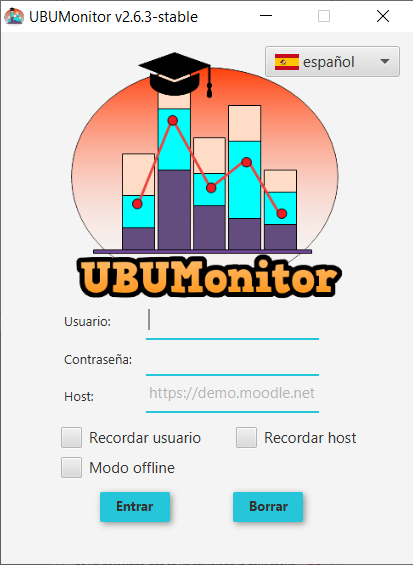
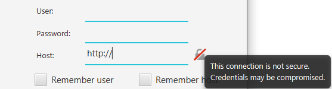
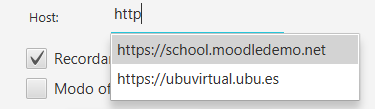
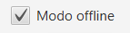

Login
=====

Once the application is started, the login screen will be displayed. The window displays the current product version at the top and allows you to select the preferred language for the application. 

  
  Login
  
Next, you must enter your **User** and **Password** credentials in Moodle. 

**VERY IMPORTANT:** the application *Never* persistently stores, nor forwards to other servers, the *password* of the user, for security reasons. The source code is available for audit and you can check which data and to which server it is sent, with a network analysis software or *sniffer* (e.g. Wireshark, Microsoft Message Analyzer, Tcpdump, etc.).

Online mode
-----------

In the **Host** field you must indicate the URL of the website of the chosen Moodle platform. When entering the host, you must include its URL, including the access protocol. 

For example:

* to access the Mount Orange School test server you will literally put: ``https://school.moodledemo.net``.
* to access the UBU's Moodle server (UBUVirtual) you will literally put: ``https://ubuvirtual.ubu.es``

It is recommended that you always access secure servers (with https://) to ensure that the information you send is encrypted.

However, UBUMonitor allows access to any Moodle server that validates users in the form of login/password. If the server accessed is NOT secure and does not encrypt the communication (with ``http://`` instead of ``https://``), an icon and an additional *tooltip* are displayed to warn the user. It is recommended to use this option with caution and **only for accesses to a trusted local server**.

  
  Non-secure Login

The application **remembers** the *urls* of the servers that have been used **previously**, suggesting in a predictive way those *urls*.

  
  Suggested previously used hosts

For convenience, the option is given to **Remember user** and **Remember host**, avoiding having to fill in the fields again in subsequent accesses. This information is saved in a ``config.properties`` file in the current directory, if we check one or both options. The **Delete** button allows you to remove the text from the three fields.

After entering the credentials we press the button **Enter**. If the data is valid, it will load the following screen, and if not, it will show an error message in the lower area of the window. 

In case of unexpected error, it is recommended to check in this order:

#. That the network connection is **active**.
#. That the *login/password/host* has been typed in **correctly** (check that **NO** has capital lock enabled). 
#. That the current server is **active**, accessing directly with a browser.
#. That your Moodle server has active **web services**. To check this, try using the official mobile application (see https://docs.moodle.org/all/es/Moodle_app). If this application doesn't work either, your server **NO** allows such access. Contact your Moodle server administrator, to check the possible activation of **web services**. If you are working with a local installation, activate the web services by following the instructions in https://docs.moodle.org/38/en/Using_web_services.

If the problems persist, after checking the above, contact the authors of the application to report the error.

Offline mode
------------

Additionally, if the box **Offline mode** is selected, the application can work **without a network connection**. 

  
  Offline mode selected

This allows you to work even with the Moodle server unavailable or down. The only requirement is that **previously** the course data has been downloaded to the local cache, in previous working sessions with **network connection**. 

Even so, it is still necessary to enter the user, password and url of the *host*, since the data is located and decrypted from these values guaranteeing always a secure access to the local data.