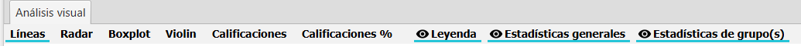
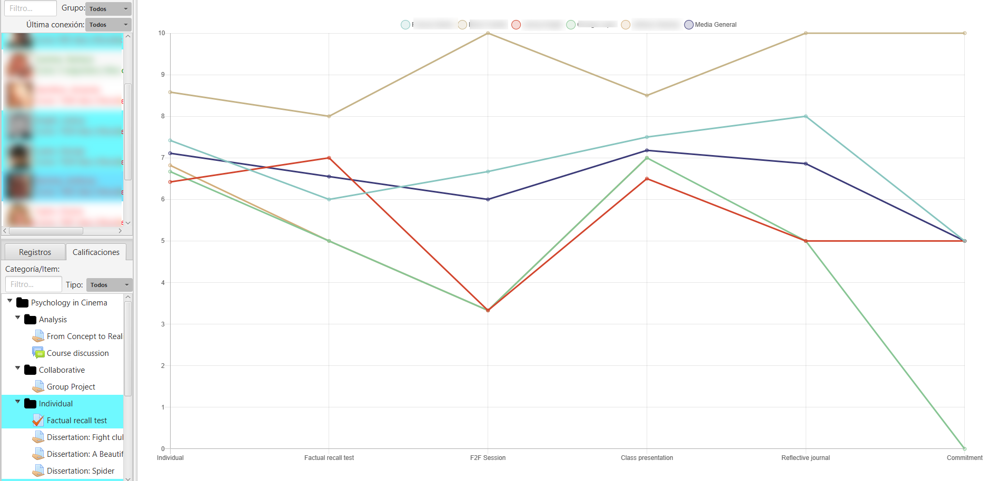
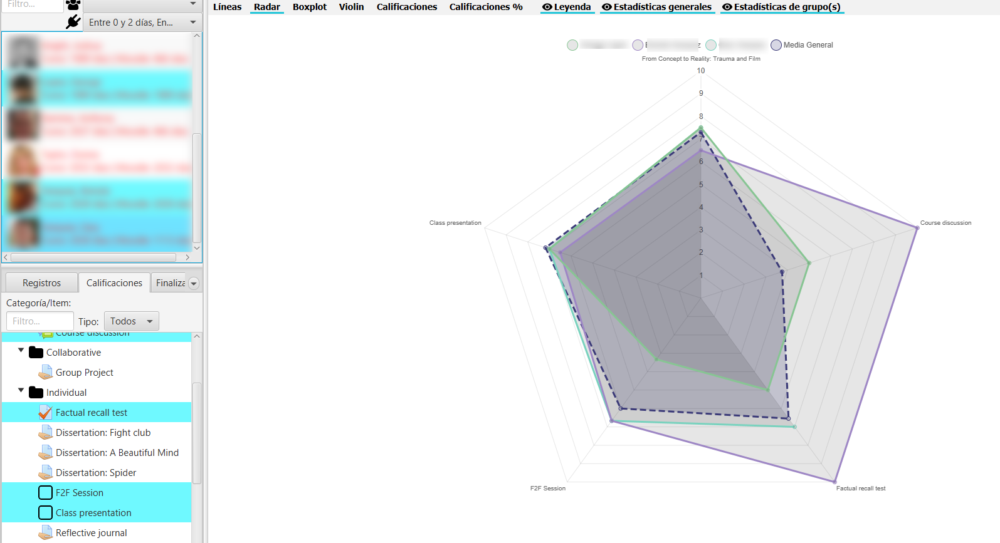
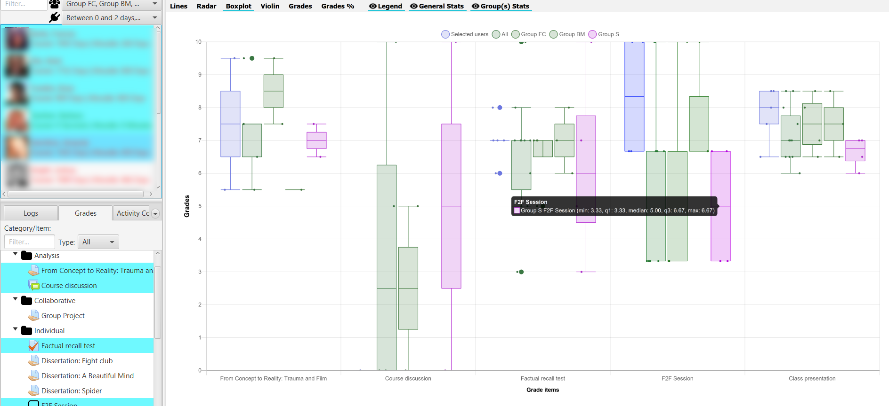
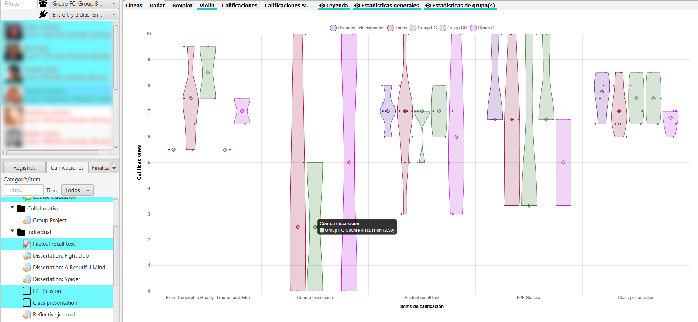
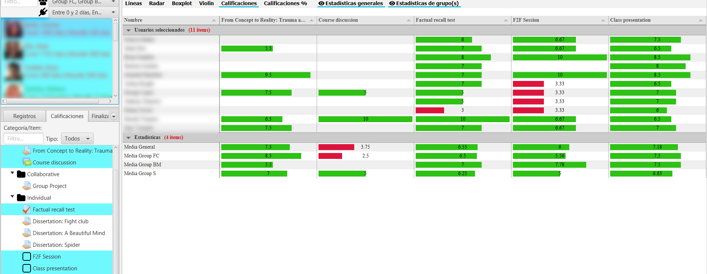
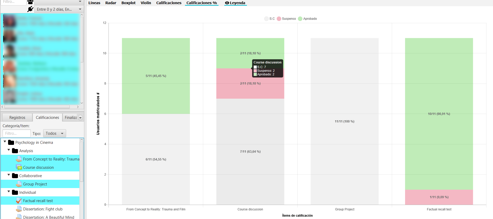

Grade visualization
===================

In the lower left corner, on the **Ratings** tab, the gradebook's hierarchy is displayed along with its filters. The view allows for multiple selection. You can expand and enlarge this area at any time to better see the names of the grading elements.

.. figure:: images/Calificador.png
  :width: 200
  :alt: Visualization of grades
  :align: center
  
  Visualization of grades
  
The view shows the equivalent of the gradebook in Moodle. There are two types of filters that are used together:

* **Text field**: by grade item name.
* **Type selector**: by assessment element type (e.g. forum, assignment, quiz, etc.)

Once the **Grades** tab is selected, the chart area is loaded in the main central area of the application. At the top there are buttons to select the type of chart to be shown and to hide/show the legend, general statistics and group statistics. Depending on the selected chart, this display of legend, general and group statistics is enabled or disabled.

  
  Grade toolbar
  
It must be taken into account that **non-rated items** (rated "-") **do not count** for the calculation of averages, neither in the generation of boxplot or violin-type charts.

It should also be noted that in the chart, when clicking on the points or elements of a **particular student** on the chart or table, it is positioned in the corresponding user list, to facilitate their identification.

Line chart
----------

Displays a line chart representing student grades, rescaled to the range [0, 10], for each element of the selected gradebook. The average value is also shown as a reference.

  
  Line chart

Radar chart
-----------

Radar chart or also known as spider diagram or Kiviat. Very useful to compare two or more course participants, on the different axes corresponding to items or categories of gradebook.

  
  Radar chart
  
Boxplot chart
-------------

Displays information from a boxplot or box-and-whisker diagram with the students' grades. In this chart, we can see the maximums, minimums, the median, first and third quartiles, and *ouliers* (as thicker points) if they exist.

  
  Boxplot chart

Additionally, if we select groups, their corresponding bloxplot is added to the chart. The same with the selected group of students. 

Violin chart
------------

Displays a violin chart for the grades of all students and the selected student body, if any.

  
  Violin chart
  

Additionally, if the students have been filtered by group, it also shows the violin chart for that group. The violin chart shows the median as a larger diamond.

Grade table
-----------

It shows a table with the grades, as well as the overall average and the average of each of the course groups. The table can be sorted alphabetically or numerically, in ascending or descending order, by clicking alternatively on the column title.

The data is presented scaled in the range [0, 10] with a horizontal bar proportional to the grade. The cut-off mark is taken as 5, showing in red those values that do not reach that mark, and in green those values that are equal or higher (the cut-off mark can be changed, see Sec :ref:`configuration` in the section **General**).

  
  Grade table with group and general means

The data are presented in two blocks of students and statistics, which can be contracted or expanded.

Percentage chart
----------------

Displays a stacked bar chart with the percentage of selected students who are not graded (*N.C*), fail (*Suspended*), or pass (*Failed*) each of the selected grading items.

  
  Percentages on each grade item

The cut-off note can be changed, see Sec :ref:`configuration` in the **General** section.