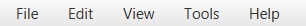
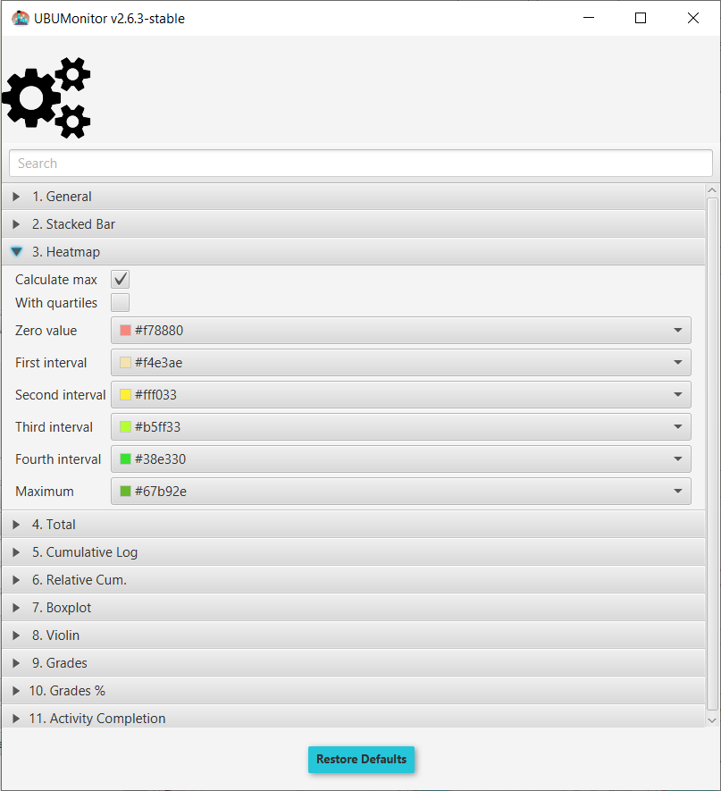

Main screen
===========

The main screen is divided into:

* In the upper area on the *menu bar*, the different existing menus . 
* In the upper left corner, the *list of registered users* including number and filters by role, group and last update date.
* In the lower left corner, the selection of records, appraisals or completion of activity.
* In the central area, the different active graphics and filters, according to the previous selection. 
* In the upper right corner the photo of the current user. A context menu is available to see his name, to close session in the server or to exit the application.
* In the lower left area, there is a connection mode button (green for online vs. red for offline), the name of the loaded subject and the host we are currently accessing. 
* In the lower right area it is shown the date and time of the last update of the local data being displayed.

.. figure:: images/Ventana_principal_de_inicio.png
  :width: 600
  :alt: Main screen
  :align: center
  
  Initial main screen
 
 
In the user and record/qualification and activity views, multiple selection of individual elements is allowed by holding down the "Control" key while selecting them with the mouse, and of adjacent elements by pressing the "Shift" key. The combination "Ctrl" + "A" selects all the elements of the view.

In the graphics and tables generated in the central area, a context menu is always enabled (with the right mouse button), allowing the **export of data** in:

* Graphic format ``PNG``.
* Text format ``CSV``.
* CVS" text format, breaking down the data (if this option is available)

.. figure:: images/Menu_contextual_exportacion.png
  :width: 200
  :alt: Export contextual menu
  :align: center
  
  Export contextual menu

**Note: Many screenshots in this manual have been taken against data on the free **Mount Orange School** server available at https://school.moodledemo.net. Our thanks and appreciation to the Moodle development group who have given us their approval.
  
Barra de menú 
---------------------

At the top of the window there is a menu bar with different options. Keyboard shortcuts are enabled by pressing the ALT key:

  
  Menu bar

**File**

* **Change subject**: closes the current window and returns to the **Course Selection** window.

* **Update course**: downloads the most recent records and updates grades and completion of activities for the current course, via the web. This option is not available in offline mode.

* **Export CSV data**: exports the data of the current course, in ``.csv`` format to the selected folder. It generates the following 8 files:

   * ``course_modules.csv``: contains the course modules
   * ``courses.csv``: information about the courses in which the students are enrolled.
   * ``enrolled_users.csv``: students enrolled.
   * ``grades.csv``: grades.
   * ``groups.csv``: groups.
   * ``logs.csv``: complete records.
   * ``roles.csv``: active roles.
   * ``sections.csv``: course sections.

* **Logout**: closes the current session and returns to the login screen.

* **Exit**: closes the application.

**Edit**

* **Delete selection**: Removes the current selection from all available views.

**View**

* **Themes**: allows you to select different display themes by changing the visual appearance of the application. Three themes are available: Modena, Caspian and Bootstrap 3. 

**Tools**

* **Change configuration**: allows to customize general and particular operation and display options of each type of generated graphic. Once the changes have been selected, click on the close window button (the changes are applied automatically). Selecting the **Restore Default Values** button restores the initial values configured in the application.

  
  Configuration
  
* **Import configuration**: allows to import a configuration previously stored by the user for a subject.
* **Export configuration**: exports the current options configured in the subject by the user.

**Help**

* **Course statistics**: shows a brief summary of the current data of the course such as number of users, number of logs, etc.

.. figure:: images/estadisticas.png
  :width: 400
  :alt: Basic statistics of the current subject
  :align: center
  
  Basic statistics of the current subject
  
  
* **More info**: opens the GitHub project in the default browser window.
* **About the application**: Shows the general information of the application regarding version, authors and acknowledgements.

.. figure:: images/Acerca_de.png
  :width: 400
  :alt: About...
  :align: center
  
  Information about the application

List of registered users
------------------------

This view shows the list of users enrolled in the course, along with their photograph and the time since their last access to the current course and Moodle platform in either minutes, hours or days. The system time is taken as a reference.

.. figure:: images/lista_usuarios_matriculados.png
  :width: 300
  :alt: List of registered users
  :align: center
  
  List of registered users
  
Users are coloured, according to their last connection date to the course, to facilitate the detection of **risk of abandonment**, using the following coding:

* Red: if you have not connected for more than 13 days
* *Yellow*: if you've been online for 7 to 12 days.
* Blue: if you've been online for 3 to 6 days
* Green: if you've logged on in the last 2 days.

It also gives the option of applying four filters together, with multiple selection:

* **Text field**: filter the list by name and/or surname.
* Role Selector: Select the role you want to filter by (e.g. student, teacher, non-editor teacher, etc.)
* Group selector: select the group you want to filter by.
* **Last Connection Selector**: last access selector.

In the upper left corner, the number of participants that comply with the applied filters is displayed.

Student's file
--------------

If we select a student with the right button, a contextual menu appears *View <user name>* that launches a dialog to show the student's card. 

.. figure:: images/Ficha_de_alumnos.png
  :width: 400
  :alt: Student's file
  :align: center
  
  Student's file
  
This file shows: name, surname, email, last access dates to the subject and to Moodle, first access date to Moodle, roles, groups and number of courses/subjects you are enrolled in. 

Coloured circles are used to indicate the date of last login to the subject, or to Moodle, using the same criteria as seen previously in the list of registered users (i.e. red, yellow, blue or green).

In the right area, the complete list of courses in which you are enrolled is displayed. The list is shown by identifier, but can be sorted alphabetically in ascending or descending order by clicking on **Enrolled courses**.

The buttons at the bottom with arrows to the left and right allow you to go forward or backward in the list of students, updating the data.