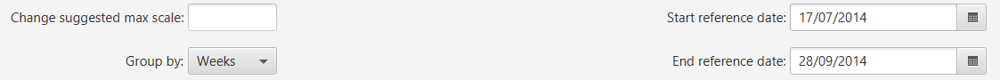
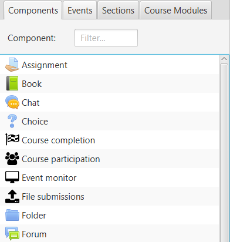
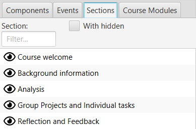
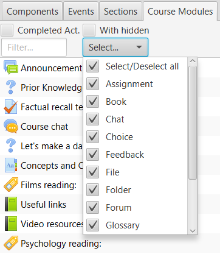
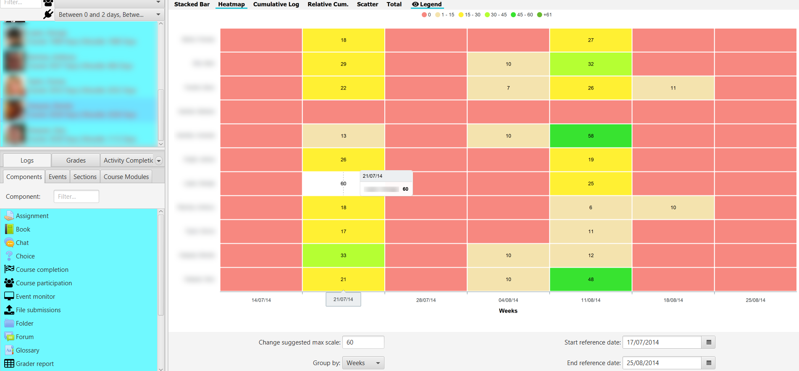
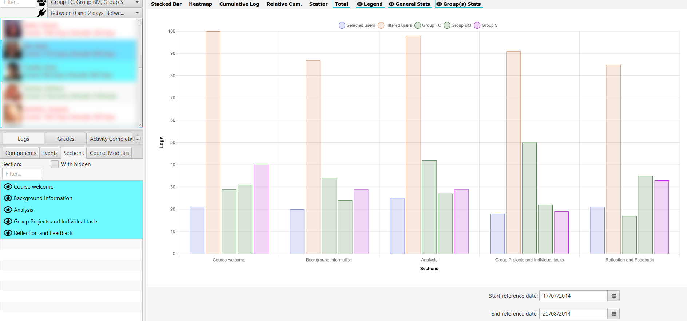

Log visualization
=================

Log options
-----------

By clicking on the **Logs** tab, in the lower left corner, several filtering options appear at the bottom of the main screen.

  
  Log filter
  
* **Suggested full scale change**: allows the full scale of the Y axis to be changed. The value is updated when changing the selected components and/or events or the other options. It also provides useful information when showing that there is a user with that scale.
* **Group by**: groups the logs in different ways

   * Hours
   * Days
   * Days of the week
   * Weeks 
   * Months
   * All
   
* **Start reference date**: the indicative start date shown when grouping. It initially takes the value of the subject configuration in Moodle.
* **End reference date**: the indicative end date shown when grouping. Initially it takes as end date the minimum of the current date and the end date of the course if it exists.

Note that the start and end reference date are not taken into account when making groupings. For example, when grouping by months and an initial date of 06/17/2019 to 06/24/2019, it will not show the logs between those two days, but will show all those of June.

In the groupings by **Hours** and **Days of the week** they do not use the date selector, being calculated on the total of logs, therefore they are disabled.

In the graphics, when you click on the points or elements of a specific student, it is positioned in the view of the corresponding user, to facilitate their identification. The student's file is available to consult additional information.

In the lower left area, the possible tabs for selecting elements on which to generate the graphs are shown: **Components**, **Events**, **Sections** or **Course Modules**. Multiple selection is allowed on all of them and filtering by text.

Components
----------

It lists the course logs according to the type of **Component**. Includes typical Moodle activities and resources, and additionally any generated by the particular activity on the course. Only components that have been generated by users enrolled in the current course are displayed.

  
  List of components
  
Events
------

It lists the course logs according to the **Component and Event** that it is. Only components and events generated by current users enrolled in the course are displayed. It basically breaks down the types of events that occur on the components.

.. figure:: images/ListaEventos.png
  :width: 300
  :alt: List of events
  :align: center
  
  List of events
  
Sections
--------

It shows the structure of sections in which the course is organized, in the same order as they are in the course. In practice, they usually correspond to topics or weeks. Initially only the visible sections are shown but by selecting **With hidden**, all are shown.

  
  List of sections
  
Course module
-------------

It shows the complete set of course modules, including all the resources and activities that have been created. They are displayed in the order in which they are found in the course. Initially only the visible modules are shown but by selecting **With hidden**, all are shown. It is also possible to filter only those modules that have active completion tracking, by checking the **Act.Complet** box. Filtering with multiple selection is allowed, according to the module type.

  
  List of modules

Stacked bar chart
-----------------

Displays in stacked bars the number of logs for each of the selected users. Different colors are used for each of the elements. The lines indicating the average value of the currently filtered users are also stacked.

.. figure:: images/GraficoBarrasApiladas.png
  :width: 600
  :alt: Stacked bar chart
  :align: center
  
  Stacked bar chart

If the cursor is placed on a stacked bar, the identity of the student and the breakdown of values is displayed in a *tooltip*.

Setting the maximum value to **Change suggested maximum scale:** recalculates and sets the maximum on the Y-axis.
  
HeatMap chart
-------------

Displays a "heatmap" for selected users The heatmap colours from red to green, from lower to higher intensity, in relation to the number of user accesses to the selected items and to the filter selection in the lower zone. 

  
  HeatMap chart
  
If we click on the upper legend in a range, for example on the zero value, those values in that range are highlighted in the graph, making it easier, for example, to detect students at risk of dropping out or in other situations.
 
.. figure:: images/GraficoHeatMapResaltandoValor.png
  :width: 600
  :alt: HeatMap chart
  :align: center
  
  HeatMap chart highliting selected threshold
  
Setting the maximum value to **Change suggested maximum scale:** recalculates and adjusts the color palette.

Cumulative Chart
----------------

Displays the accumulated value of the number of logs, over time. The average value is included for comparison with a dashed line. It allows to show the evolution along the course of the number of accesses by each student and to compare it with the rest.

.. figure:: images/Acumulados.png
  :width: 600
  :alt: Cumulative Chart
  :align: center
  
  Cumulative Chart

Rel. Cumulative Chart
---------------------

Displays the cumulative value of the number of logs against the average value as a reference, over time. The measurement as a reference line always corresponds to the red dashed line at the zero point. It allows you to show the evolution relative to the average over the course of time.

  
  Rel. Cumulative Chart related to the mean value
  
Scatter chart
-------------

Displays the time distribution of logs over time for each selected user. It represents the temporal distribution of the different accesses at a glance, making it easier to compare them.

  
  Scatter chart

Total chart
-----------

Displays the total number of filtered user records in a time period for the selected items. It allows the comparison of accesses between elements in a direct way. 

  
  Total chart
  
If we select groups, their totals are shown, taking into account the filter by role. Additionally you can select users from the list of filters, to display the totals on that dummy group.